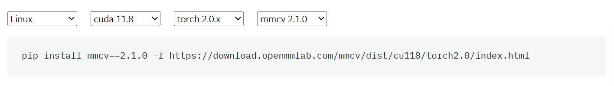

# image-segmentation

这个项目基于mmsegmentation框架(mmlab)，
提供mmsegmentation从0到1的实践，包含训练和推理教程

## News

- 🤗 更新训练配置文件介绍
- 🤗 更新mmsegmentation环境配置和测试


# Prepare 

我们使用了mmsegmentation的分支：mmsegmenation-1.x

[**mmsegmentation-1.x(github)**](https://github.com/open-mmlab/mmsegmentation/tree/1.x)

Clone mmsegmentation-1.x:
```
git clone https://github.com/open-mmlab/mmsegmentation.git
```

## 创建环境

测试环境（推荐）：
```
Python 3.8.0
pytorch 2.0.0
torchvision 0.15.0
mmcv 2.1.0
mmdeploy  1.3.1
mmengine  0.10.3
mmsegmentation  1.2.2
```
参考：MMSegmentation 官方文档：[**mmsegmentation官方文档**](https://mmsegmentation.readthedocs.io/zh-cn/latest/get_started.html)</br>
pytorch官网(下载):[**Previous PyTorch Versions**](https://pytorch.org/get-started/previous-versions/)

**创建环境（需要安装anaconda/miniconda）**
```
conda create --name mmseg python=3.8 -y   # 创建环境
conda activate mmseg  # 激活环境
```
**安装 pytoch**
``` 
# 官方安装pytorch
conda install pytorch torchvision -c pytorch  
# 推荐
conda install pytorch==2.0.0 torchvision==0.15.0 torchaudio==2.0.0 pytorch-cuda=11.8 -c pytorch -c nvidia
``` 

需要安装和torch、cuda对应版本的mmcv：[**mmcv**](https://mmcv.readthedocs.io/en/latest/get_started/installation.html )

<p align="center">
  
</p>

```
# install mmcv
pip install mmcv==2.1.0 -f https://download.openmmlab.com/mmcv/dist/cu118/torch2.0/index.html
```
**other need**
``` 
pip install -U openmim
pip install mmdeploy==1.3.1
pip install mmengine==0.10.3
``` 
install mmsegmentation：Installation from source code/Use mmsegmentation as a third-party library

安装mmsegmentation：源码安装/第三方库安装
- Installation from source code(源码安装)：直接在当前项目中开发和运行mmsegmentation
- Use mmsegmentation as a third-party library(第三方库安装：mmsegmentation作为依赖库，如果需要修改网络结构、添加数据集，需要到conda环境修改（mmseg\Lib\site-packages\mmseg）
``` 
# Installation from source code 源码安装
cd mmsegmentation
pip install -v -e .
# Use mmsegmentation as a third-party library  第三方库安装
pip install mmsegmentation==1.2.2
``` 

## 验证环境
download config and checkpoints in：
``` 
cd .\mmsegmentation-1.x\
mim download mmsegmentation --config pspnet_r50-d8_4xb2-40k_cityscapes-512x1024 --dest .
``` 
可以在当前工作目录看到 **pspnet_r50-d8_4xb2-40k_cityscapes-512x1024.py** | **pspnet_r50-d8_512x1024_40k_cityscapes_20200605_003338-2966598c.pth**

## 测试
``` 
python demo/image_demo.py demo/demo.png configs/pspnet/pspnet_r50-d8_4xb2-40k_cityscapes-512x1024.py pspnet_r50-d8_512x1024_40k_cityscapes_20200605_003338-2966598c.pth --device cuda:0 --out-file result.jpg
```
你将在当前文件夹中看到一个新图像result.jpg
<p align="center">
  
</p>

# 如何训练

使用mmsegmentation-1.x/tools/train.py进行图像分割模型训练

## 配置文件介绍

[训练配置文件介绍](config_readme.md)

## 训练流程

- 数据集配置
  - 数据集类别：mmsegmentation-1.x/configs/upernet/upernet_r50_4xb4-80k_ade20k-512x512.py中num_classes
  - 数据集路径：修改mmsegmentation-1.x/configs/_base_/datasets/ade20k.py中data_root(data_root中包含train/val/test)
  - 训练集和测试集路径：mmsegmentation-1.x/configs/_base_/datasets/ade20k.py中train_dataloader和val_dataloader中img_path和seg_map_path
  - 数据集配置：mmsegmentation-1.x/mmseg/datasets/ade.py，修改METAINFO对应类别classes和palette，单类别检测修改为 METAINFO = dict(
        classes=('background','自己的的类别'),
        palette=[[0, 0, 0],[255, 255, 255]])
  - 数据集配置：mmsegmentation-1.x/mmseg/datasets/ade.py:单类别训练需要将reduce_zero_label改为False
  - 数据集配置：mmsegmentation-1.x/mmseg/datasets/ade.py:img_suffix和seg_map_suffix根据样本后缀进行修改

**注意:非源码安装（将mmseg安装为第三方库），需要到conda环境下mmseg库中对mmseg/datasets/ade.py进行修改**

- 训练命令调用，单GPU训练

``` 
# python tools/train.py  ${配置文件} [可选参数]
python tools/train.py mmsegmentation-1.x/configs/upernet/upernet_r50_4xb4-80k_ade20k-512x512.py --work-dir ./results
# --work-dir 输出文件夹
``` 

训练会自动下载对应权重文件，如果已经下载好，可以在mmsegmentation-1.x/configs/_base_/models/upernet_r50.py设置对应预先训练权重
